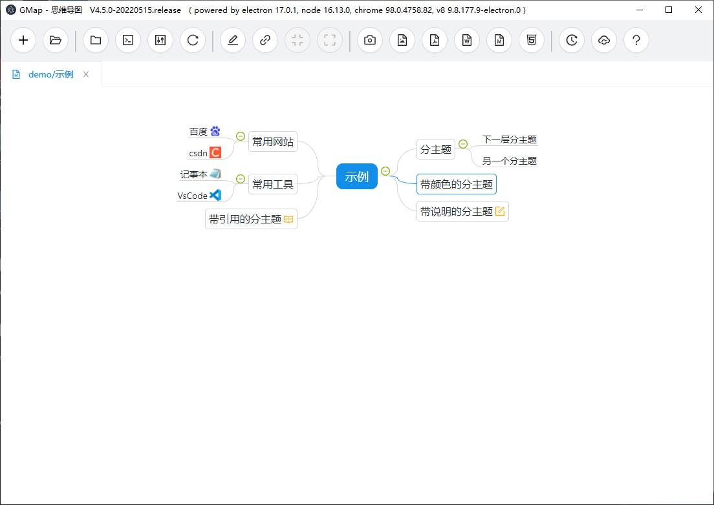

## 思维导图工具软件
通过markdown文本自动生成思维导图，不使用鼠标点击和拖拽的方式，更适合程序员手不离开键盘的使用方式。

### 运行开发服务器
- npm start：启动react开发服务器
- npm run electron：启动electron进程

### 部署

- 外部依赖项
  - 克隆 [https://gitee.com/gigi198436/gmap-backend](https://gitee.com/gigi198436/gmap-backend) 到本地，安装相关依赖，把编译后的`gmap-backend.exe`文件复制到`externals`目录。编译命令在`scripts/build.bat`。
  - 克隆 [https://gitee.com/gigi198436/gmap_backend_assist](https://gitee.com/gigi198436/gmap_backend_assist) 到本地，把编译后的`gmap_backend_assist.dll`文件复制到`externals`目录。
- npm run build：打包react项目到build目录
- 复制如下指定内容目录到electron预编译目录的resources/app下

| 分类      |目录或文件名| 说明               |
|---------|-|------------------|
| 主进程     | main         | 主进程相关文件，其中包含启动入口 |
|         | package.json | 主配置文件            |
| 渲染进程    | build        | 系统主功能窗口的渲染进程     |
|         | findinpage   | 查找窗口渲染进程         |
|         | toast        | 提示窗口渲染进程         |
| 外部程序    | externals    | 外部程序和导出模版        |
| 工作区相关目录 | gmaps        | 导图主目录，应为空        |
|         | cache        | 缓存目录，应为空         |
|         | work         | 工作目录，应为空         |

### 依赖的外部程序
#### 1、[https://gitee.com/gigi198436/node-go-ipc](https://gitee.com/gigi198436/node-go-ipc)
从electron主进程到go进程的ipc实现，实现方式为`命名管道`，electron端（即nodejs）使用原生`net.connect`方式，go端使用`go-winio`库（由ms开源）。  
其中实现了自定义消息格式，并在客户端和服务器都做了封装，消息中即可包含文本内容也可包含二进制内容。
#### 2、[https://gitee.com/gigi198436/gmap-backend](https://gitee.com/gigi198436/gmap-backend)
实现一些辅助功能及electron不易实现的功能，在electron主进程启动时通过`spawn`启动。go语言开发。
#### 3、[https://gitee.com/gigi198436/gmap_backend_assist](https://gitee.com/gigi198436/gmap_backend_assist)
实现一些操作系统相关的调用，如剪切板操作、提取文件的图标等功能。用vc开发。
#### 4、[https://gitee.com/gigi198436/file_runner](https://gitee.com/gigi198436/file_runner)
已废弃。老版的辅助功能，由csharp(winform)实现，现已迁移到go的实现。
