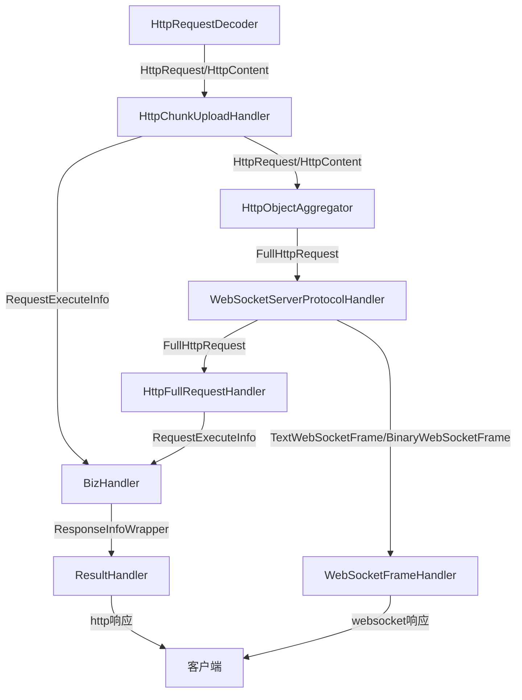

- 常用内容
	- aaa|ref:haha
	
	
***
# ref:haha

```mermaid
graph TD
	HttpRequestDecoder -- HttpRequest/HttpContent --> HttpChunkUploadHandler
	HttpChunkUploadHandler -- HttpRequest/HttpContent --> HttpObjectAggregator
	HttpChunkUploadHandler -- RequestExecuteInfo --> BizHandler
	BizHandler -- ResponseInfoWrapper --> ResultHandler
	HttpObjectAggregator -- FullHttpRequest --> WebSocketServerProtocolHandler
	WebSocketServerProtocolHandler -- FullHttpRequest --> HttpFullRequestHandler
	HttpFullRequestHandler -- RequestExecuteInfo --> BizHandler
	WebSocketServerProtocolHandler -- TextWebSocketFrame/BinaryWebSocketFrame --> WebSocketFrameHandler
	ResultHandler -- http响应 --> 客户端
	WebSocketFrameHandler -- websocket响应 --> 客户端
```