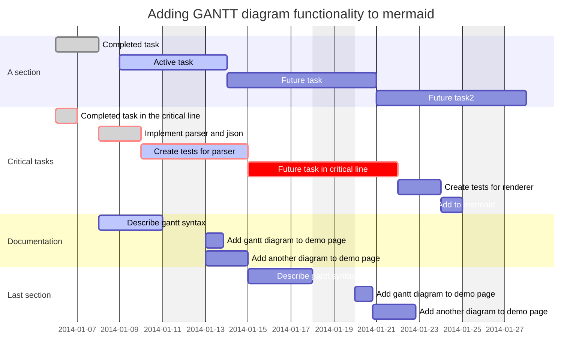
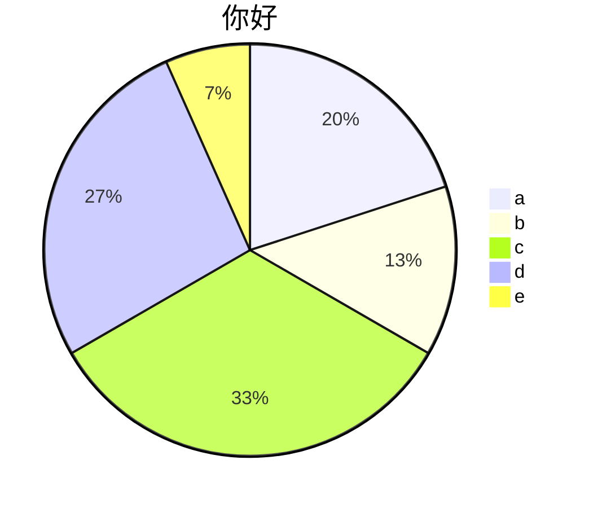
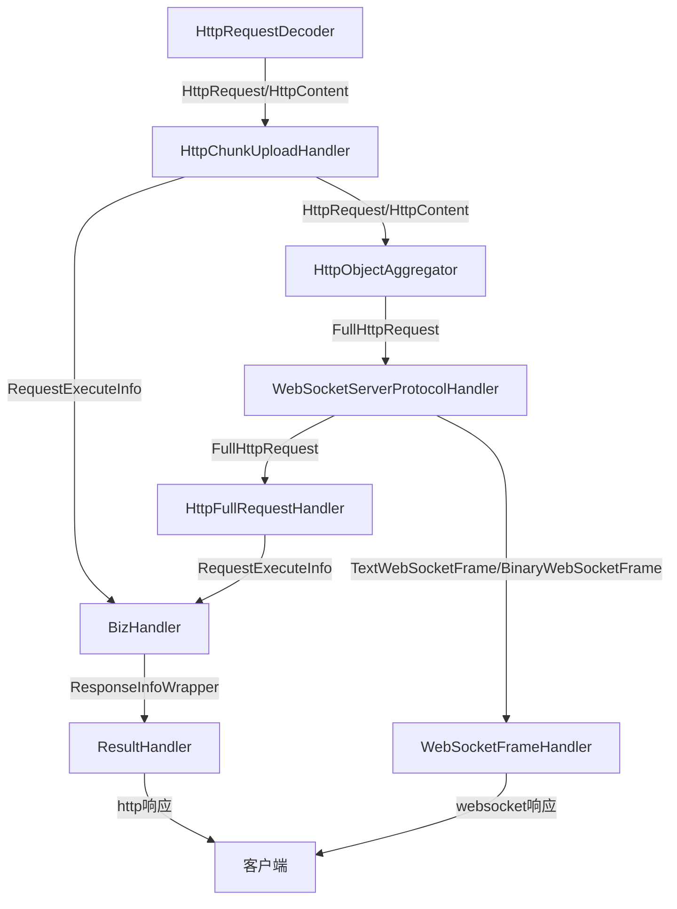
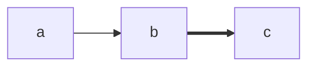

- 常用内容
	- aaa|ref:haha
	
	
***

# ref:haha

```echart
{
	w:'50%',
	h:'300px',
    title: {
        text: '某站点用户访问来源',
        subtext: '纯属虚构',
        left: 'center'
    },
    tooltip: {
        trigger: 'item'
    },
    legend: {
        orient: 'vertical',
        left: 'left',
    },
    series: [
        {
            name: '访问来源',
            type: 'pie',
            radius: '50%',
            data: [
                {value: 1048, name: '搜索引擎'},
                {value: 735, name: '直接访问'},
                {value: 580, name: '邮件营销'},
                {value: 484, name: '联盟广告'},
                {value: 300, name: '视频广告'}
            ],
            emphasis: {
                itemStyle: {
                    shadowBlur: 10,
                    shadowOffsetX: 0,
                    shadowColor: 'rgba(0, 0, 0, 0.5)'
                }
            }
        }
    ]
}
```




```echart
bar-line
w 50%
title 柱线图。。。
,2018,2019,2020


- bar,小李,1,2,30
- bar,小张,4,5,6
bar,小郑,1,40,2
```


```echart
line
w 50%
title 对比图哈哈
,2018,2019,2020
小李,1,2,3
小张,4,5,6
小郑,1,4,2
```

```echart
stack
w 50%
title 对比图哈哈
,2018,2019,2020
小李,1,2,3
小张,4,5,6
小郑,1,4,2
```

```echart
pie
title 哈哈
w 50%
h 500px
"a": 155
"d": 222
"f"   :    3432
```





aaabb
```flow
st=>start: begin
e=>end: tail
st->e
```

```sequence
a->b: haha
b->a: hoho
a->b: 333
```



```sequence
客户端->服务端: aaa
服务端->客户端: bbb
服务端->客户端: bbb
客户端->服务端: aaa
```




## aaaaa