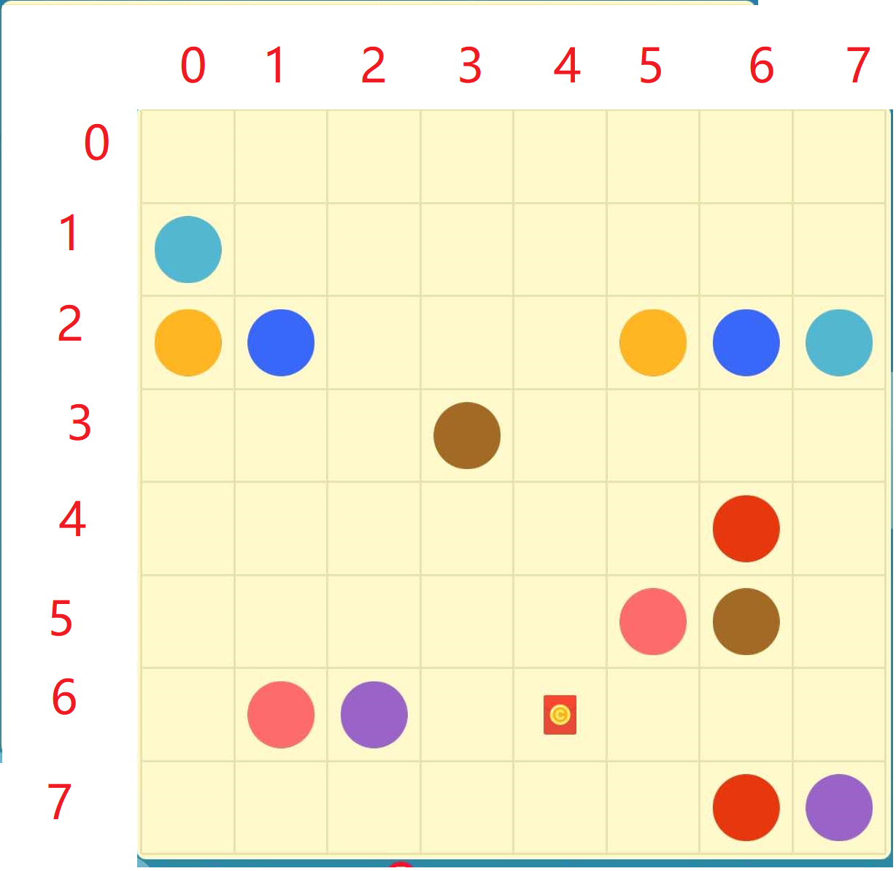

- 甘特图示例|d:20-8-2
	- 任务1|g:task1,20.3.5,20.3.10,40|m:说明对比|ref:引用对比|p:50
		- hahaha
		- 中文字
	- 任务2|g:taskx,20.3.9,4,50
	- 任务3|g:taskm,task1,10,100
	- 任务4|g:task4,20.4/6,3,30
	- 任务4|g:task41,20.4/6,3,30
	- 任务4|g:task42,20.4/6,3,30
	- 任务4|g:task43,task1-3,13,80
	
	
	- 任务4|g:tas50,20.3/31,20.4.18,30
	- 任务4|g:tas53,tas50-2,6,30
	- 任务444342|g:task5221,20.4.2,10,30
	- 任务444342342|g:task51,20.5.1,2,0
	- 没有22|m:说明对比|ref:引用对比|p:20

***
# ref:引用对比
#### haha
- aa
- bbb
