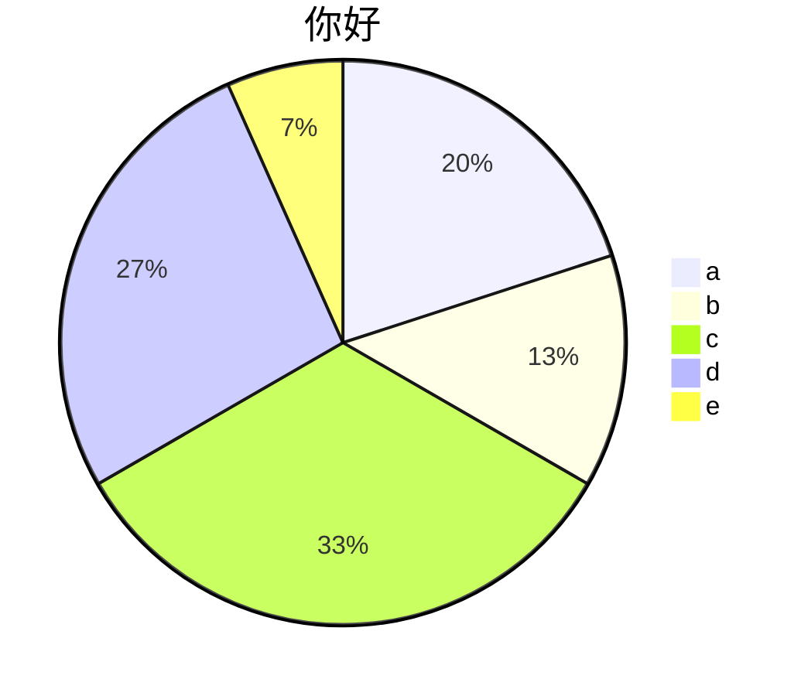
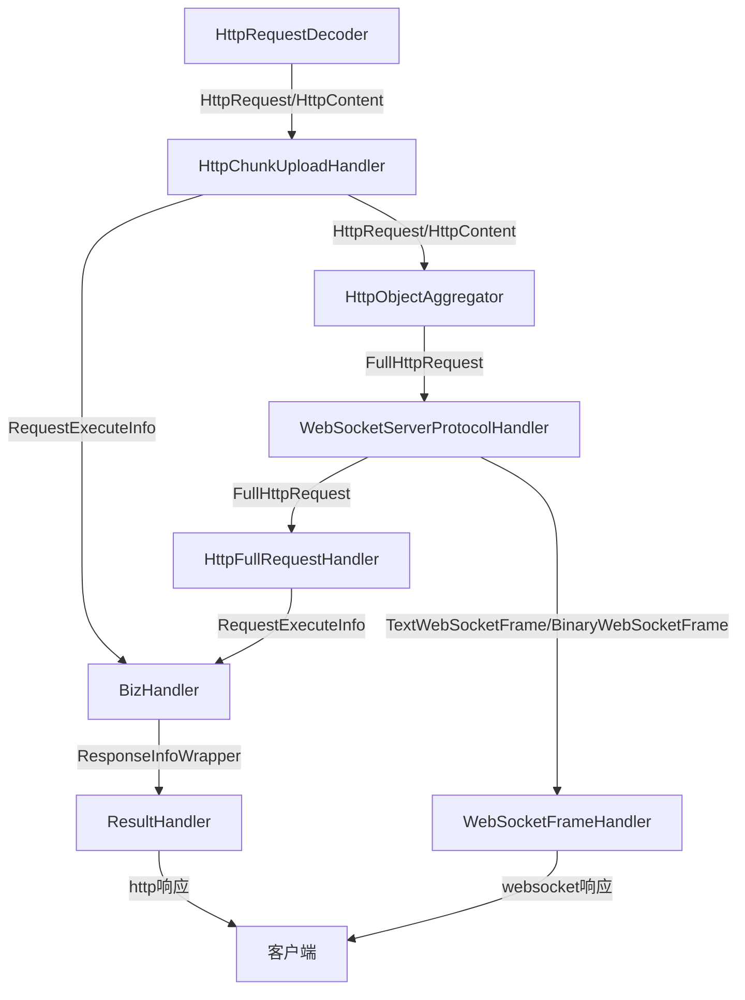
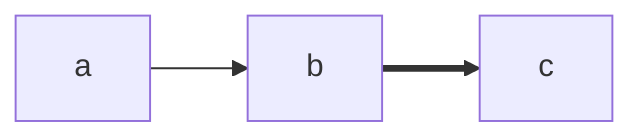

- 常用内容
	- aaa|ref:haha
	
	
***

# ref:haha

```echart
pie
title 哈哈
w 50%
h 500px
"a": 155
"d": 222
```




aaabb
```flow
st=>start: begin
e=>end: tail
st->e
```

```sequence
a->b: haha
b->a: hoho
a->b: 333
```



```sequence
客户端->服务端: aaa
服务端->客户端: bbb
服务端->客户端: bbb
客户端->服务端: aaa
```




## aaaaa