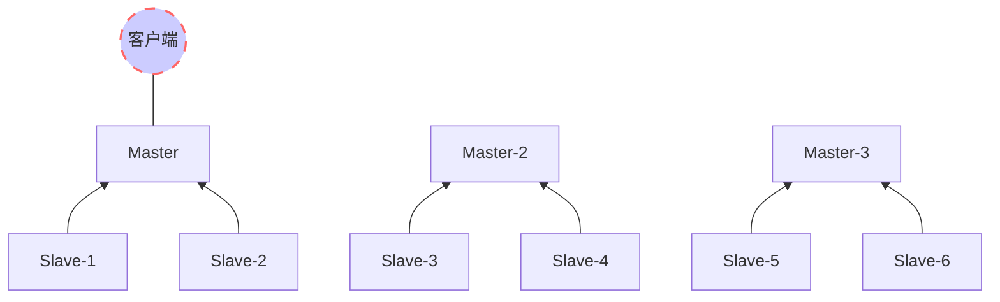

- fff|tref:xxx
	- 分主题|toid:xx,c:red|ref:分主题|[](file:///notepad)
	- c:#1890ff|带颜色的分主题|toid:xx
	- 带说明的分主题|m:balabala|toid:xx,c:#1890ff
	- 带链接的分主题|[](diropenby://F:\workspace2\front\ims@@code)
	- 带引用的分主题|ref:长段文字|id:xx
	- 分组|[链接](grp://file:///notepad)|[链接](grp://file:///control)

***
# ref:分主题
```echart
{
  title: {
    text: 'Stacked Line'
  },
  tooltip: {
    trigger: 'axis'
  },
  legend: {
    data: ['Email', 'Union Ads', 'Video Ads', 'Direct', 'Search Engine']
  },
  grid: {
    left: '3%',
    right: '4%',
    bottom: '3%',
    containLabel: true
  },
  toolbox: {
    feature: {
      saveAsImage: {}
    }
  },
  xAxis: {
    type: 'category',
    boundaryGap: false,
    data: ['Mon', 'Tue', 'Wed', 'Thu', 'Fri', 'Sat', 'Sun']
  },
  yAxis: {
    type: 'value'
  },
  series: [
    {
      name: 'Email',
      type: 'line',
      stack: 'Total',
      data: [120, 132, 101, 134, 90, 230, 210]
    },
    {
      name: 'Union Ads',
      type: 'line',
      stack: 'Total',
      data: [220, 182, 191, 234, 290, 330, 310]
    },
    {
      name: 'Video Ads',
      type: 'line',
      stack: 'Total',
      data: [150, 232, 201, 154, 190, 330, 410]
    },
    {
      name: 'Direct',
      type: 'line',
      stack: 'Total',
      data: [320, 332, 301, 334, 390, 330, 320]
    },
    {
      name: 'Search Engine',
      type: 'line',
      stack: 'Total',
      data: [820, 932, 901, 934, 1290, 1330, 1320]
    }
  ]
}
```
 
 
 
# tref:xxx
xxxxxxxxxxxxxxxxxxx

# ref:长段文字
行内的公式 $a+b+c=50$  
非行内的公式 a+b+c=50
```latex
a=b+ \frac{x}{y}
```

```sequence
Andrew->China: Says Hello
Note right of China: China thinks\nabout it
China-->Andrew: How are you?
Andrew->>China: I am good thanks!
```

```flow
st=>start: Start:>http://www.google.com[blank]
e=>end:>http://www.google.com
op1=>operation: My Operation
sub1=>subroutine: My Subroutine
cond=>condition: Yes
or No?:>http://www.google.com
io=>inputoutput: catch something...
para=>parallel: parallel tasks

st->op1->cond
cond(yes)->io->e
cond(no)->para
para(path1, bottom)->sub1(right)->op1
para(path2, top)->op1
```

